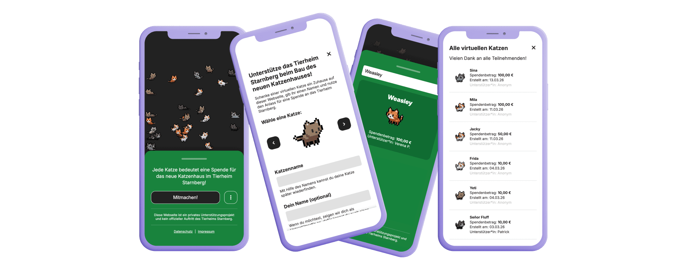

## Cat House

Visit: https://cats.verenapues.com/

A lightweight donation platform for the Tierheim Starnberg cat house rebuild campaign. Creating a virtual cat in the app as a visible contribution should motivate people to donate through official shelter channels. This turns abstract fundraising progress into a shared, playful visual story.



## Architecture

Full-stack TypeScript across the entire project — consistent types between client and API without extra overhead.

- **Frontend:** SvelteKit
- **Backend:** NestJS + PostgreSQL + Prisma
- **Infrastructure:** Docker Compose (dev and prod), deployed on a vServer

TypeScript was the primary driver for the stack choices: SvelteKit for a lightweight UI, NestJS for a structured backend that fits naturally with TypeScript. Prisma handles DB migrations and generates typed query results.

Cat animations are built on a sprite starter kit (see [seethingswarm.itch.io/catset](https://seethingswarm.itch.io/catset)), extended with additional coat variations and animations.

## Essential Commands

```bash
# Start development environment, migrate and seed db
make up

# Stop all services
make down

# Show all available commands
make help

# Run client unit tests
cd cathouse-client && npm test

# Run API unit tests
cd cathouse-api && npm test
```
